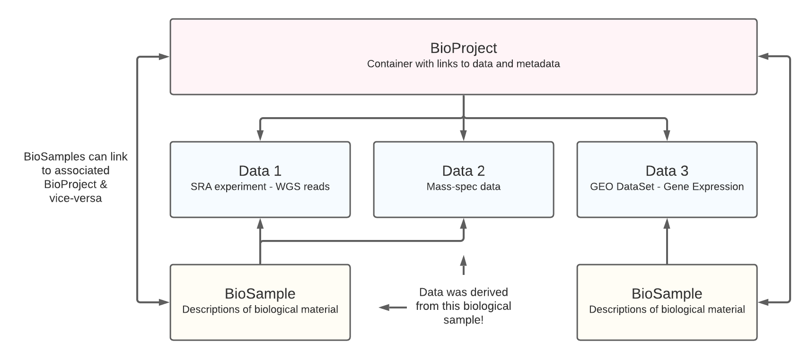
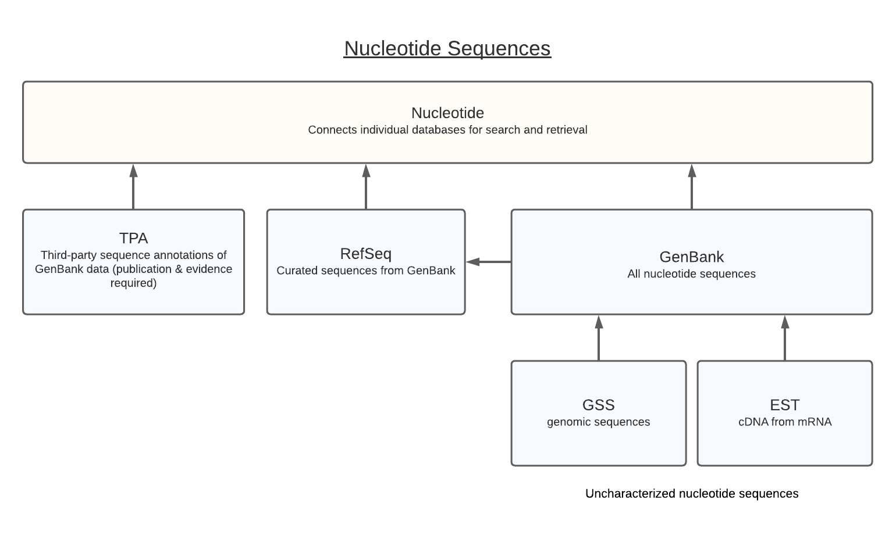
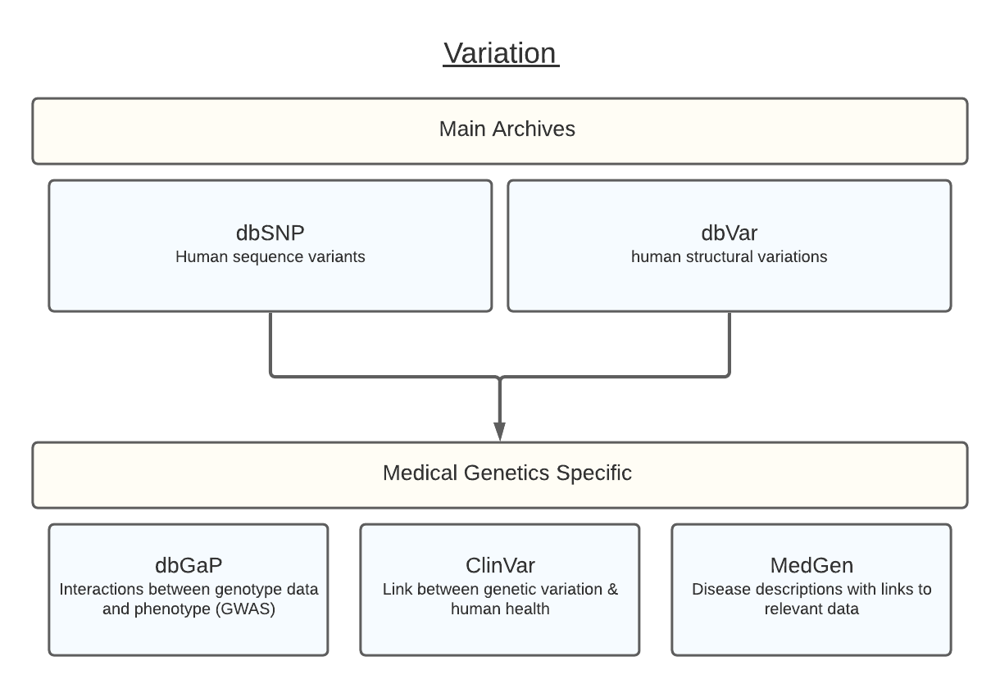

# Accessing public data

  

## Introduction
Thanks to research becoming more open in the last decade, there is now a ***huge amount*** of freely available data online.  The push towards repeatable analysis and open access to data has had enormous impact on medical science, and will continue to do so in the future. Clearly, there is too much data to properly cite in a single document, but hopefully the main sections have been covered here. 

This document is a ***beginners guide*** for how to access this data. 

Data has been divided into sections as best as possible.  In each section, the following is covered:
* Who uses the data? (what type of analysis / field)
* How to access (download or use)
* Format of the data 

 

## Contents
* [Summary of common data repositories](#Common-data-Repositories)
    * [NCBI](#NCBI)
    * [EMBL-EBI](#EMBL-EBI)
    * [DDBJ](#DDBJ)

* [Sequence Reads](#Reads)
    * [DNA](#DNA)
    * [RNA](#RNA)
    * [Epigenetics](#Epigenetics)

* [Genomics](#Genomics)
    * [Assemblies](#Assemblies)
    * [Annotations](#Annotations)
    * [Genes](#Genes)
    * [Taxonomy](#Taxonomy)

* [Transcriptomics](#Transcriptomics)
    * [Expression data](#Expression-data)
    * [Transcript isoforms](#Transcript-isoforms)
    * [Networks & pathways](#Networks-&-pathways)

* [Variation](#Variation)
    * [Sequence variation (SNVs/SNPs, Indels)](#Sequence-variation-(SNVs/SNPs,-Indels))
    * [Structural variation](#Structural-variation)

* [Proteomics](#Proteomics)
    * [Protein structures](#Protein-structures)
    * [Protein interactions](#Protein-interactions)
    * [Protein expression](#Protein-expression)
    * [Protein domains and functions](#Protein-domains-and-functions)

  

## Common data Repositories 
Jump to
* [Overview](#Overview)
* [Data sharing between organisations](#Shared-Data)
* [Unique archives per organisation](#Unique-Archives-per-Organisation)
* [Non open-access archives](#Non-open-access-archives)

 

### Overview
There are 3 major organisations which house publically available data. While other independent resources exist, the bulk of open-access data is stored within these 3 groups:

* The National Center for Biotechnology Information (NCBI)
* The European Bioinformatics Institute (EMBL-EBI)
* The DNA Data Bank of Japan (DDBJ)

 

### Data Sharing

 NCBI, EMBL-EBI, and DDBJ are all part of the International Nucleotide Sequence Database Collaboration (INSDC). The INSDC is an initiative which *encourages the sharing of nucleotide sequence data between organisations*. As a result, data submitted to the archives below will be shared across relevant NCBI, EMBL-EBI, and DDBJ databases.  A large amount of information - from raw read data, to alignments, assemblies, functional annotations, and sample information - are shared. 

The following is a table of  ***archives which share data***

 

| Data | NCBI | EMBL-EBI | DDBJ |
| ------ | ------ | ------ | ------ |
| NGS reads | [Sequence Read Archive (SRA)](https://www.ncbi.nlm.nih.gov/sra/?term=all%5Bfilter%5D) | [ENA](https://www.ebi.ac.uk/ena/browser/home) | [DDBJ Sequence Read Archive (DRA)](https://ddbj.nig.ac.jp/DRASearch/) |
| Capillary electrophoresis reads | [Trace Archive](https://trace.ncbi.nlm.nih.gov/Traces/trace.cgi?view=search) | [ENA](https://www.ebi.ac.uk/ena/browser/home) | [DDBJ Trace Archive (DTA)](https://www.ddbj.nig.ac.jp/dta/index-e.html) |
| Annotated sequences (genes, assemblies etc) | [GenBank / RefSeq](https://www.ncbi.nlm.nih.gov/nuccore/?term=all%5Bfilter%5D) | [ENA](https://www.ebi.ac.uk/ena/browser/home) | [DDBJ](http://ddbj.nig.ac.jp/arsa/?lang=en) |
| Samples | [BioSample](https://www.ncbi.nlm.nih.gov/biosample/?term=all%5Bfilter%5D) | [BioSamples](https://www.ebi.ac.uk/biosamples/) | [BioSample](https://ddbj.nig.ac.jp/BSSearch/) |
| Studies | [BioProject](https://www.ncbi.nlm.nih.gov/bioproject/?term=all%5Bfilter%5D) | [ENA](https://www.ebi.ac.uk/ena/browser/home) | [BioProject](https://ddbj.nig.ac.jp/BPSearch/) |

 

Similar databases are available at each of these organisations, and they mirror (hold a copy of) each others relevant data. This is helpful as it reduces data redundancy (NCBI, EMBL-EBI, and DDBJ accessions for a single piece of data are linked), improves download/upload speeds due to geographic closeness, and encourages international sharing of data. 

 

### Projects, Samples, and data

Understanding the hierarchy between archives is one of the most tricky aspects when navigating public data. Anyone who has worked with databases will know that the relationships between data are often hard to express in a standard way.   The 3 main organisations (NCBI, EMBL-EBI and DDBJ) arrange information into **BioProjects**, **BioSamples**, and Data, which is a good solution given the challenge. 

**BioProjects** are containers which store links.  They are like folders which hold links to all the data and metadata associated with some project. The links can be directly to data, or can be to descriptions of the data (metadata). 

Side note: EMBL-EBI call these ‘BioStudies’ instead of **BioProjects** for some unknown reason. We will use the term BioProject from here.  

**BioSamples** are actually just descriptions of biological material. They do not relate to the data which was generated, but they can link to data which was derived from the particular biological sample / material.  For example, if you isolated a colony of bacteria for whole genome sequencing (WGS), a BioSample entry would be created to describe the bacterial isolate. The BioSample would then have a link to the WGS data, specifying “the WGS dataset was generated from this biological material!”.

    

 

### NCBI
American 

Read more here: 
https://www.ncbi.nlm.nih.gov/home/documentation/

 

### EMBL-EBI
ELIXIR data archives: 
https://elixir-europe.org/services/list?field_scientific_domain_tid=All&field_elixir_badge_tid=All&field_type_of_service_tid=1134&field_elixir_node_target_id=All&combine=

https://www.ebi.ac.uk/ena/browser/about/content

 

### DDBJ

Is bad

 

### Conclusion

Many academic journals now insist on data being publically accessible. They may even specifically ask for your data to be housed in the above, and will request accession numbers to confirm this before publishing. #TODO confim this

  

## Reads

Jump to:
 [Next Gen Sequencing](#Next-Gen-Sequencing)
 [Capillary Electrophoresis](#Capillary-Electrophoresis)

  

🔴 Low 🟡 Med 🟢 High

 

| Name | Data stored | Organisms | Ease of Access | Amount of data | Data curation /quality | 
| --- | :-: | :-: | :-: | :-: | :-: |
|   **Next Gen Sequencing** |
| [ENA](https://www.ebi.ac.uk/ena/browser/home) | All nucleotide data | All | 🟢 | 🟢 | 🔴 |
| [SRA](https://www.ncbi.nlm.nih.gov/sra) | High-throughput sequence data - capillary, short & long NGS reads | All | 🟡 | 🟢 | 🔴 |
| [DRA](https://www.ddbj.nig.ac.jp/dra/index-e.html) | High-throughput sequence data - capillary, short & long NGS reads | All | 🔴 | 🟢 | 🔴 |
|   **Capillary Electrophoresis** |
| [NCBI Trace Archive](https://trace.ncbi.nlm.nih.gov/Traces/trace.cgi) | Capillary sequencing only (replaced by SRA)  | All | 🔴 | 🟢 | 🔴 |
| [DDBJ Trace Archive (DTA)](https://www.ddbj.nig.ac.jp/dta/index-e.html) | Capillary sequencing only (replaced by DRA)  | All | 🔴 | 🟢 | 🔴 |

 

### Next Gen Sequencing

 

**Who uses the data**

Sequence reads are one of the most commonly used forms of bioinformatics data. They often are represented as DNA sequence (using ATGC) in FASTQ format regardless of whether they are DNA or RNA sequence. 

Reads form the basis of modern-day bioinformatics, and are used in nearly every field. Common uses of reads include: 
* Differential gene expression (DE) analysis
* Variant calling & GWAS
* Genome assembly
* Microbiome characterisation
* Epigenetic analysis
* Transcript isoform detection

 

**How to access**

    

    

    

 

**Data format**

 

### Capillary Electrophoresis 

 

**Who uses the data**

**How to access**

**Data format**

  

## Genomics
Jump to
 [Assemblies](#Assemblies)
 [Annotations](#Annotations)
 [Genes](#Genes)
 [Taxonomy](#Taxonomy)

  

🔴 Low 🟡 Med 🟢 High

 

| Name | Data stored | Organisms | Ease of Access | Amount of data | Data curation /quality | 
| --- | :-: | :-: | :-: | :-: | :-: |
|    **All nucleotide sequences** |
| [ENA](https://www.ebi.ac.uk/ena/browser/home) | All nucleotide sequences | All | 🟢 | 🟢 | 🔴 |
| [NCBI Nucleotide](https://www.ncbi.nlm.nih.gov/nuccore/) | All nucleotide sequences | All | 🟡 | 🟢 | 🔴 |
| [DDBJ](https://www.ddbj.nig.ac.jp/index-e.html) | All nucleotide sequences | All | 🔴 | 🟢 | 🔴 |
|    **Genome Assemblies** | 
| [ENA](https://www.ebi.ac.uk/ena/browser/home) | All nucleotide sequences | All | 🟢 | 🟢 | 🔴 |
| [NCBI Assembly](https://www.ncbi.nlm.nih.gov/assembly/) | Genome Assemblies | All | 🟡 | 🟢 | 🔴 |
| [DDBJ](https://www.ddbj.nig.ac.jp/index-e.html) | All nucleotide sequences | All | 🔴 | 🟢 | 🔴 |
|   **Taxonomy** | 
| [NCBI Taxonomy](https://www.ncbi.nlm.nih.gov/Taxonomy/Browser/wwwtax.cgi?id=1423) | The standard taxonomy system | All | 🟡 | 🟢 | 🔴 |
|   **Functional Elements** | 
| [ENCODE](https://www.encodeproject.org/) | Annotations for human functional DNA elements | Human + select model organisms | 🟢 | 🟢 | 🟢 |
| [GENCODE](https://www.gencodegenes.org/) | Annotations for human (and mouse) genes | Human, Mouse | 🟢 | 🟢 | 🟢 |
| [GeneCards](https://www.genecards.org/) | Aggregator for all gene-centric data. Each gene listed once. | Human | 🟢 | 🟢 | 🟡 |
| [NCBI Gene](https://www.ncbi.nlm.nih.gov/gene/) | Genes and links to data/metadata | All | 🟡 | 🟢 | 🔴 |
| [ENA](https://www.ebi.ac.uk/ena/browser/home) | All nucleotide information | All | 🟢 | 🟢 | 🔴 |
| [NCBI Nucleotide](https://www.ncbi.nlm.nih.gov/nuccore/) | All nucleotide information | All | 🟡 | 🟢 | 🔴 |
| [DDBJ](https://www.ddbj.nig.ac.jp/index-e.html) | All nucleotide information | All | 🔴 | 🟢 | 🔴 |

### All nucleotide sequences

 

**Who uses the data**

**How to access**

    

**Data format**

 

### Genome Assemblies

 

**Who uses the data**

**How to access**

**Data format**

 

### Taxonomy

 

**Who uses the data**

**How to access**

**Data format**

 

### Functional Elements

 

**Who uses the data**

**How to access**

**Data format**

  

## Transcriptomics
Jump to
* [Expression data](#Expression-data)
* [Transcript isoforms](#Transcript-isoforms)
* [Networks & pathways](#Networks-&-pathways)

 

🔴 Low 🟡 Med 🟢 High

 

| Name | Data stored | Organisms | Ease of Access | Amount of data | Data curation /quality | 
| --- | :-: | :-: | :-: | :-: | :-: |
|   **Bulk RNA** | 
| [GTEx](https://gtexportal.org/home/) | Tissue-specific gene expression and regulation | Human | 🟢 | 🟢 | 🟢 |
| [AOE](https://aoe.dbcls.jp/en) | Aggregates publicly available gene expression data | All | 🟢 | 🟢 | 🟡 |
| [Expression Atlas](https://www.ebi.ac.uk/gxa/home) | Abundance and localisation of RNA | All | 🟢 | 🟡 | 🟢 |
| [GEO datasets](https://www.ncbi.nlm.nih.gov/gds/?term=all%5Bfilter%5D) | Functional Genomics Data (from NGS, Arrays etc) | All | 🟡 | 🟢 | 🟡 |
| [GEO profiles](https://www.ncbi.nlm.nih.gov/geoprofiles/?term=all%5Bfilter%5D) | Expression profiles for a specific condition | All | 🟡 | 🟢 | 🟡 |
| [ArrayExpress](https://www.ebi.ac.uk/arrayexpress/) | Functional Genomics Data (NGS, Arrays etc) | All | 🟡 | 🟢 | 🟡 |
|   **Single Cell** |
| [The Human Cell Atlas](https://www.humancellatlas.org/learn-more/human-cell-atlas/) | Single cell studies | Human | 🟢 | 🟢 | 🟡 |
| [Single Cell Expression Atlas](https://www.ebi.ac.uk/gxa/sc/home) | Single cell studies | All | 🟢 | 🟡 | 🟢 |
| [Single Cell Portal](https://singlecell.broadinstitute.org/single_cell) | Single cell studies | All | 🟡 | 🟢 | 🟡 |
| [Tabula Muris](https://tabula-muris.ds.czbiohub.org/) | Single-cell transcriptome data | Mouse | 🟡 | 🔴 | 🟢 |
| [Human cell landscape](https://db.cngb.org/HCL/) | Cell types and localisations | Human | 🔴 | 🔴 | 🟢 |
|   **Networks** |
| [Connectivity Map (CMap)](https://clue.io/data) | Transcriptional responses to chemical, genetic, and disease perturbation | Human | 🔴 | 🟢 | 🟡 |
|   **Transcript Isoforms** |
| [GTEx](https://gtexportal.org/home/) | Tissue-specific gene expression and regulation | Human | 🟢 | 🟢 | 🟢 |
|   **Noncoding RNA** |
| [RNAcentral ](https://rnacentral.org/) | All RNA information | All | 🟢 | 🟢 | 🟡 |

 

  

## Variation
Jump to
* [Sequence variation (SNVs/SNPs, Indels)](#Sequence-variation-(SNVs/SNPs,-Indels))
* [Structural variation](#Structural-variation)

 

🔴 Low 🟡 Med 🟢 High

 

| Name | Data stored | Organisms | Ease of Access | Amount of data | Data curation /quality | 
| --- | :-: | :-: | :-: | :-: | :-: |
|   **Sequence Variation (SNPs, Indels etc)** | 
| [EVA](https://www.ebi.ac.uk/eva/) | All variant data | All | 🟡 | 🟢 | 🔴 |
| [NCBI dbSNP](https://www.ncbi.nlm.nih.gov/snp/) | All sequence variant data | Human | 🔴 | 🟢 | 🔴 |
| [ClinVar](https://www.ncbi.nlm.nih.gov/clinvar/) | Variant-phenotype relationship (health) | Human | 🔴 | 🟢 | 🟡 |
| [OMIM](https://www.omim.org/) | Gene-phenotype relationship | Human | 🔴 | 🟡 | 🟢 |
|   **Structural Variation (SVs)** | 
| [EVA](https://www.ebi.ac.uk/eva/) | All variant data | All | 🟡 | 🟢 | 🔴 |
| [NCBI dbVar](https://www.ncbi.nlm.nih.gov/dbvar/) | All structural variant data | Human | 🔴 | 🟢 | 🔴 |
| [DGV](http://dgv.tcag.ca/dgv/app/home) | Structural variation in healthy control samples (archived) | Human | 🔴 | 🟡 | 🟡 |

 

### Sequence variation (SNP/SNV, Indel etc)

    

### Structural variation

  

## Proteomics
jump to
* [Protein structures](#Protein-structures)
* [Protein interactions](#Protein-interactions)
* [Protein expression](#Protein-expression)
* [Protein domains and functions](#Protein-domains-and-functions)

 

🔴 Low 🟡 Med 🟢 High

 

| Name | Data stored | Organisms | Ease of Access | Amount of data | Data curation /quality | 
| --- | :-: | :-: | :-: | :-: | :-: |
|   **Protein Sequences** | 
| [UniProt](https://www.uniprot.org/help/about) | Protein sequences and annotations | All | 🟢 | 🟢 | 🟢 |
| [Enzyme portal](https://www.ebi.ac.uk/enzymeportal/) | Concise summary of enzymes | All | 🟢 | 🟡 | 🟢 |
| [NCBI Protein](https://www.ncbi.nlm.nih.gov/protein/) | Protein sequences and annotations | All | 🔴 | 🟢 | 🔴 |
|   **Protein Domains & Families** | 
| [InterPro](https://www.ebi.ac.uk/interpro/about/interpro/) | Protein domains & families | All | 🟢 | 🟢 | 🟡 |
| [Pfam](http://pfam.xfam.org/) | Protein families | All | 🔴 | 🟢 | 🟡 |
|   **Protein Structures** | 
| [PDB](https://www.rcsb.org/) | Protein structures & associated data | All | 🟢 | 🟢 | 🟢 |
| [PDBe](https://www.ebi.ac.uk/pdbe/node/1) | Protein structures & associated data | All | 🟡 | 🟢 | 🟢 |
| [PDBJ](https://pdbj.org/) | Protein structures & associated data | All | 🔴 | 🟢 | 🟢 |
|   **Protein Expression** | 
| [The Human Protein Atlas](https://www.proteinatlas.org/) | Antibody-based imaging, mass spectrometry, transcriptomics data  | Human | 🟢 | 🟢 | 🟢 |
| [PRIDE](https://www.ebi.ac.uk/pride/) | Mass spectrometry data | All | 🟡 | 🟢 | 🟢 |
|   **EM, XRay, NMR Data** | 
| [EMDB](https://wwwdev.ebi.ac.uk/emdb/) | 3D EM density maps | All | 🟡 | 🟢 | 🟡 |
| [EMDataResource](https://www.emdataresource.org/index.html) | 3D EM density maps, models & metadata | All | 🔴 | 🟢 | 🟡 |
| [EMPIRE](https://www.ebi.ac.uk/pdbe/emdb/empiar/) | Raw electron microscopy images | All | 🟡 | 🟡 | 🟡 |
| [BMRB](https://bmrb.io/) | NMR data | All | 🔴 | 🟢 | 🟡 |

 

### Protein structures
* PDB 
* PDBe 
 

### Protein interactions
* STRING
* BRENDA

 

### Protein expression
* PRIDE (mass spec data)
* Human Protein Atlas
 

### Protein domains and functions
* InterPro

  

## Pathways & Reactions

 

🔴 Low 🟡 Med 🟢 High

 

| Name | Data stored | Organisms | Ease of Access | Amount of data | Data curation /quality | 
| --- | :-: | :-: | :-: | :-: | :-: |
| [Reactome](https://reactome.org/) | Biological pathways | All | 🟢 | 🟢 | 🟢 |
| [Rhea](https://www.rhea-db.org/) | Reactions of biological interest | All | 🟡 | 🟢 | 🟢 |
| [KEGG](https://www.genome.jp/kegg/kegg2.html) | Biological systems | All | 🔴 | 🟢 | 🟢 |

 

  

## Metagenomics / Microbiome

 

🔴 Low 🟡 Med 🟢 High

 

| Name | Data stored | Organisms | Ease of Access | Amount of data | Data curation /quality | 
| --- | :-: | :-: | :-: | :-: | :-: |
| [SILVA](https://www.arb-silva.de/) | ribosomal RNA sequences | All | 🟡 | 🟢 | 🟢 |
| [Ribosomal database project (RDP)](https://rdp.cme.msu.edu/index.jsp) | ribosomal RNA sequences | Bacteria, Archaea, Fungi | 🟡 | 🟢 | 🟡 |
| [MGnify](https://www.ebi.ac.uk/metagenomics/) | Microbiome experiments & data | All | 🟢 | 🟢 | 🔴 |
| [BacDrive](https://bacdive.dsmz.de/) | Bacterial information (Geographical, biochemical) | Bacteria | 🟢 | 🟢 | 🟢 |

 

  

## Metabolomics

 

🔴 Low 🟡 Med 🟢 High

 

| Name | Data stored | Organisms | Ease of Access | Amount of data | Data curation /quality | 
| --- | :-: | :-: | :-: | :-: | :-: |
| [ChEMBL](https://www.ebi.ac.uk/chembl/)  | Bioactive molecules | All | 🟢 | 🟢 | 🟢 |
| [MetaboLights](https://www.ebi.ac.uk/metabolights)  | Studies of Metabolites | All | 🟡 | 🟢 | 🟡 |

 

  

## Domain Specific

 

🔴 Low 🟡 Med 🟢 High

 

| Name | Data stored | Organisms | Ease of Access | Amount of data | Data curation /quality | 
| --- | :-: | :-: | :-: | :-: | :-: |
|   **Cancer** |   
| [COSMIC](https://cancer.sanger.ac.uk/cosmic) | Somatic mutations in human cancer | Human | 🟢 | 🟢 | 🟢 |  
|   **Biological Images** | 
| [BioImage archive](https://www.ebi.ac.uk/biostudies/BioImages/studies) | All biological image data  | All | 🟢 | 🟢 | 🟢 |
| [Image Data Resource (IDR)](https://idr.openmicroscopy.org/about/) | Image datasets from published studies | All | 🟢 | 🟡 | 🟢 |   
| [Cell Image Library ](http://www.cellimagelibrary.org/home) | Images, videos, and animations of cells | All | 🟢 | 🟢 | 🟡 |
|   **Neuroscience** |   
| [Allen Brain Map](https://portal.brain-map.org/) | Data and analysis related to the brain | Human, Mouse | 🟢 | 🟢 | 🟢 |  
|   **Immunology** |   
| [ImmGen](https://www.immgen.org/) | Microarray gene expression & regulation | Mouse | 🟢 | 🟢 | 🟢 |  
|   **Biodiversity** |   
| [GBIF](https://www.gbif.org/) | Biodiversity data | All | 🟡 | 🟢 | 🟢 | 
|   **Disease Biomarkers** |   
| [BIONDA](http://bionda.mpc.ruhr-uni-bochum.de/start.php) | Biomarker candidates published in PubMed articles | Human | 🔴 | 🟢 | 🟡 |   
|   **Fruit flies** |   
| [FlyBase](https://flybase.org/) | All data types | Fruit flies | 🔴 | 🟢 | 🔴 |  
|   **Epigenomics** |   
| [MethBase](http://smithlabresearch.org/software/methbase/) | Reference methylomes (bisulfide-seq) | Selected model organisms | 🔴 | 🟡 | 🟡 | 

 

  