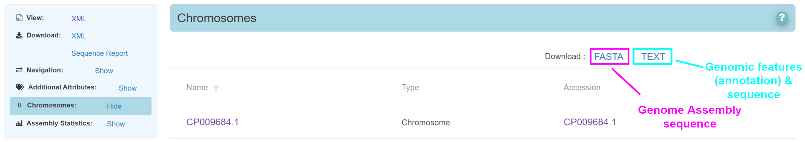

# Introduction
Thanks to research becoming more open in the last decade, there is now a ***huge amount*** of freely available data online.  The push towards repeatable analysis and open access to data has had enormous impact on medical science, and will continue to do so in the future. Clearly, there is too much data to properly cite in a single document, but hopefully the main sections have been covered here. 

This document provides ***an overview*** of some of the commonly used ***open-access archives.*** 

  

# Databases

Jump to
* [Genomics & Functional Elements](#Genomics-&-Functional-Elements)
* [Transcriptomics](#Transcriptomics)
* [Networks, pathways & reactions](#Networks,-pathways-&-reactions)
* [Variation](#Variation)
* [Proteomics](#Proteomics)
* [Microbiomics / Metagenomics](#Microbiomics-/-Metagenomics)
* [Imaging](#Imaging)
* [Domain Specific](#Domain-Specific)

  

## Genomics & Functional Elements

| Name | Data stored | Organisms | Ease of Access | Amount of data | Data curation /quality | 
| :-: | :-: | :-: | :-: | :-: | :-: |
|   **Nucleotide Databases** |
| [ENA](https://www.ebi.ac.uk/ena/browser/home) | All nucleotide sequences | All | 🟢 | 🟢 | 🔴 |
| [NCBI Nucleotide](https://www.ncbi.nlm.nih.gov/nuccore/) | All nucleotide sequences | All | 🟡 | 🟢 | 🔴 |
| [DDBJ](https://www.ddbj.nig.ac.jp/index-e.html) | All nucleotide sequences | All | 🔴 | 🟢 | 🔴 |
|   **Functional Elements** |
| [ENCODE](https://www.encodeproject.org/) | Annotations for human functional DNA elements | Human + select model organisms | 🟢 | 🟢 | 🟢 |
| [GENCODE](https://www.gencodegenes.org/) | Annotations for human (and mouse) genes | Human, Mouse | 🟢 | 🟢 | 🟢 |
| [GeneCards](https://www.genecards.org/) | Aggregator for all gene-centric data. Each gene listed once. | Human | 🟢 | 🟢 | 🟡 |
| [NCBI Gene](https://www.ncbi.nlm.nih.gov/gene/) | Genes and links to data/metadata | All | 🟡 | 🟢 | 🔴 |
|   **Sequence Reads** |
| [ENA](https://www.ebi.ac.uk/ena/browser/home) | All nucleotide data | All | 🟢 | 🟢 | 🔴 |
| [SRA](https://www.ncbi.nlm.nih.gov/sra) | High-throughput sequence data | All | 🟡 | 🟢 | 🔴 |
| [DRA](https://www.ddbj.nig.ac.jp/dra/index-e.html) | High-throughput sequence data | All | 🔴 | 🟢 | 🔴 |
|   **Genome Assemblies** |
| [NCBI Assembly](https://www.ncbi.nlm.nih.gov/assembly/) | Genome Assemblies | All | 🟢 | 🟢 | 🔴 |
| [ENA](https://www.ebi.ac.uk/ena/browser/home) | All nucleotide sequences | All | 🟡 | 🟢 | 🔴 |
| [DDBJ](https://www.ddbj.nig.ac.jp/index-e.html) | All nucleotide sequences | All | 🔴 | 🟢 | 🔴 |
|   **Taxonomy** |
| [NCBI Taxonomy](https://www.ncbi.nlm.nih.gov/Taxonomy/Browser/wwwtax.cgi?id=1423) | The standard taxonomy system | All | 🟡 | 🟢 | 🔴 |

  

## Transcriptomics

| Name | Data stored | Organisms | Ease of Access | Amount of data | Data curation /quality | 
| :-: | :-: | :-: | :-: | :-: | :-: |
|   **Bulk Tissue Gene Expression** |
| [GTEx](https://gtexportal.org/home/) | Tissue-specific gene expression and regulation | Human | 🟢 | 🟢 | 🟢 |
| [AOE](https://aoe.dbcls.jp/en) | Aggregates publicly available gene expression data | All | 🟢 | 🟢 | 🟡 |
| [Expression Atlas](https://www.ebi.ac.uk/gxa/home) | Abundance and localisation of RNA | All | 🟢 | 🟡 | 🟢 |
| [GEO datasets](https://www.ncbi.nlm.nih.gov/gds/?term=all%5Bfilter%5D) | Functional Genomics Data (from NGS, Arrays etc) | All | 🟡 | 🟢 | 🟡 |
| [GEO profiles](https://www.ncbi.nlm.nih.gov/geoprofiles/?term=all%5Bfilter%5D) | Expression profiles for a specific condition | All | 🟡 | 🟢 | 🟡 |
| [ArrayExpress](https://www.ebi.ac.uk/arrayexpress/) | Functional Genomics Data (NGS, Arrays etc) | All | 🟡 | 🟢 | 🟡 |
|   **Single Cell Gene Expression** |
| [The Human Cell Atlas](https://www.humancellatlas.org/learn-more/human-cell-atlas/) | Single cell studies | Human | 🟢 | 🟢 | 🟡 |
| [Single Cell Expression Atlas](https://www.ebi.ac.uk/gxa/sc/home) | Single cell studies | All | 🟢 | 🟡 | 🟢 |
| [Single Cell Portal](https://singlecell.broadinstitute.org/single_cell) | Single cell studies | All | 🟡 | 🟢 | 🟡 |
| [Tabula Muris](https://tabula-muris.ds.czbiohub.org/) | Single-cell transcriptome data | Mouse | 🟡 | 🔴 | 🟢 |
| [Human cell landscape](https://db.cngb.org/HCL/) | Cell types and localisations | Human | 🔴 | 🔴 | 🟢 |
|   **Gene Regulation** |
| - | - | - | - | - | - |
|   **Transcript Isoforms** |
| [GTEx](https://gtexportal.org/home/) | Tissue-specific gene expression and regulation | Human | 🟢 | 🟢 | 🟢 |
|   **Noncoding RNA** |
| [RNAcentral ](https://rnacentral.org/) | All RNA information | All | 🟢 | 🟢 | 🟡 |

  

## Networks, pathways & Reactions

| Name | Data stored | Organisms | Ease of Access | Amount of data | Data curation /quality | 
| :-: | :-: | :-: | :-: | :-: | :-: |
|   **Networks** |
| - | - | - | - | - | - |
|   **Pathways** |
| - | - | - | - | - | - |
|   **Reactions** |
| - | - | - | - | - | - |
|   **Metabolites** |
| - | - | - | - | - | - |

  

## Variation

| Name | Data stored | Organisms | Ease of Access | Amount of data | Data curation /quality | 
| :-: | :-: | :-: | :-: | :-: | :-: |
|   **Sequence variants (SNVs/SNPs, small indels etc)** |
| - | - | - | - | - | - |
|   **Structural Variants** |
| - | - | - | - | - | - |
|   **Cancer** |
| - | - | - | - | - | - |

  

## Proteomics

| Name | Data stored | Organisms | Ease of Access | Amount of data | Data curation /quality | 
| :-: | :-: | :-: | :-: | :-: | :-: |
|   **Protein Sequences** |
| - | - | - | - | - | - |
|   **Protein Domains & Families** |
| - | - | - | - | - | - |
|   **Protein Expression** |
| - | - | - | - | - | - |
|   **Tertiary Structures** |
| - | - | - | - | - | - |
|   **EM, XRay, & NMR** |
| - | - | - | - | - | - |

  

## Microbiomics / Metagenomics

| Name | Data stored | Organisms | Ease of Access | Amount of data | Data curation /quality | 
| :-: | :-: | :-: | :-: | :-: | :-: |
|   **Metagenomics** |
| - | - | - | - | - | - |
|   **Microbiomics** |
| - | - | - | - | - | - |

  

## Imaging

| Name | Data stored | Organisms | Ease of Access | Amount of data | Data curation /quality | 
| :-: | :-: | :-: | :-: | :-: | :-: |

  

## Domain Specific

| Name | Data stored | Organisms | Ease of Access | Amount of data | Data curation /quality | 
| :-: | :-: | :-: | :-: | :-: | :-: |
|   **Neuroscience** |
| - | - | - | - | - | - |
|   **Immunology** |
| - | - | - | - | - | - |
|   **Fruit Flies** |
| - | - | - | - | - | - |
|   **Mouse** |
| - | - | - | - | - | - |
|   **Epigenomics** |
| - | - | - | - | - | - |
|   **Biodiversity** |
| - | - | - | - | - | - |
|   **Disease Biomarkers** |
| - | - | - | - | - | - |

  

# Database Summaries
Jump to

* [Genomics](#Genomics)
    * [NCBI, ENA, & DDBJ](#NCBI,-ENA,-&-DDBJ)
    * [Organisation - BioProjects & BioSamples](#Organisation---BioProjects-&-BioSamples)
    * [Genome Assemblies](#Genome-Assemblies)
    * [Taxonomy](#Taxonomy)
    * [Functional Elements (Annotations)](#Functional-Elements)
    * [Next Gen Sequencing](#Next-Gen-Sequencing)
    * [Capillary Electrophoresis](#Capillary-Electrophoresis)
* [Transcriptomics](#Transcriptomics)
    * [Bulk Tissue](#Bulk-Tissue)
    * [Single Cell](#Single-Cell)
    * [Gene Regulation](#Gene-Regulation)
    * [Transcript Isoforms](#Transcript-Isoforms)
    * [Noncoding RNA](#Noncoding-RNA)
* [Networks, pathways & Reactions](#Networks,-Pathways-&-Reactions)
    * [Networks](#Networks)
    * [Pathways](#Pathways)
    * [Reactions](#Reactions)
* [Variation](#Variation)
    * [Sequence Variation (SNVs/SNPs, Indels etc)](#Sequence-Variation)
    * [Structural Variation (SVs)](#Structural-Variation)
* [Proteomics](#Proteomics)
    * [Protein Sequences](#Protein-Sequences)
    * [Protein Domains & Families](#Protein-Domains-&-Families)
    * [Protein Structures](#Protein-Structures)
    * [Protein Expression](#Protein-Expression)
    * [EM, XRay, & NMR](#EM,-XRay,-&-NMR)
* [Metagenomics / Microbiomics](#Metagenomics-/-Microbiomics)
* [Metabolomics](#Metabolomics)
* [Imaging](#Imaging)
* [Domain Specific](#Domain-Specific)

  

# Genomics

Contents
* [NCBI, ENA, & DDBJ](#NCBI,-ENA,-&-DDBJ)
* [Organisation - BioProjects & BioSamples](#Organisation---BioProjects-&-BioSamples)
* [Genome Assemblies](#Genome-Assemblies)
* [Taxonomy](#Taxonomy)
* [Functional Elements (Annotations)](#Functional-Elements)

  

### NCBI, ENA, & DDBJ

 

| Name | Data stored | Organisms | Ease of Access | Amount of data | Data curation /quality | 
| :-: | :-: | :-: | :-: | :-: | :-: |
| [ENA](https://www.ebi.ac.uk/ena/browser/home) | All nucleotide sequences | All | 🟢 | 🟢 | 🔴 |
| [NCBI Nucleotide](https://www.ncbi.nlm.nih.gov/nuccore/) | All nucleotide sequences | All | 🟡 | 🟢 | 🔴 |
| [DDBJ](https://www.ddbj.nig.ac.jp/index-e.html) | All nucleotide sequences | All | 🔴 | 🟢 | 🔴 |

  

**Data Sharing - INSDC** &nbsp; &nbsp; &nbsp; 

NCBI, EMBL-EBI and DDBJ share data on a daily basis as members of the [International Nucleotide Sequence Database Collaboration (INSDC)](http://www.insdc.org/). 

All nucleotide data submitted to the following organisations are automatically shared between them - the choice of archive therefore mainly depends on familiarity - which one you personally find is easiest to use. 

 

**ENA (European Nucleotide Archive)** &nbsp; &nbsp; &nbsp; 

[The European Nucleotide Archive (ENA)](https://www.ebi.ac.uk/ena/browser/home) contains all publicly available EMBL-EBI nucleotide sequences.  This includes *coding sequences (genes), Non-coding DNA elements, genome assemblies, DNA/RNA sequence readsets* and much more.  The data itself, as well as metadata (information about the data - what it is, how it was derived, what techniques were used etc) are stored.

When searching ENA, all types of genomic data will be returned. You can then choose the specific kind of nucleotide sequence you want using filters (ie only genome assemblies, only coding sequence etc). [ENA advanced search](https://www.ebi.ac.uk/ena/browser/advanced-search) allows you to create a more specific search for your needs. 

ENA has the cleanest UI amongst ENA, NCBI Nucleotide, and DDBJ.
  

 

**NCBI Nucleotide** &nbsp; &nbsp; &nbsp; 

[The National Centre for Biotechnology Information (NCBI) Nucleotide](https://www.ncbi.nlm.nih.gov/nuccore/) is a search tool which pulls results from GenBank, RefSeq, the TPA and other repositories.  Searching NCBI Nucleotide is akin to searching all of NCBIs sequence data, so is comparable to ENA.   Similar to ENA, all kinds of genomic data is available, rather than one type only.  

In general, NCBI has an archive specific to your needs (ie NCBI Assembly for assemblies, NCBI Gene for gene sequences etc), but searching NCBI Nucleotide can indicate the total data of all types given your search.  [NCBI advanced search](https://www.ncbi.nlm.nih.gov/nuccore/advanced) is a powerful tool for searching, given you know the syntax. 

 

**DDBJ** &nbsp; &nbsp; &nbsp; 

[The DNA Data Bank of Japan (DDBJ)](https://www.ddbj.nig.ac.jp/ddbj/index-e.html) is also a member of the INSDC and so contains virtually the same nucleotide data as the archives above. The DDBJs UI and web page is harder to use than NCBI Nucleotide or ENA, and feels a little dated. Given that the DDBJ collects and shares data for INSDC members, similar results will appear using ENA or NCBI Nucleotide searches. The search tool for DDBJ is called ARSA.  

  

### Organisation - BioProjects & BioSamples

     

The three Understanding the hierarchy between archives is one of the most tricky aspects when navigating public data. Anyone who has worked with databases will know that the relationships between data are often hard to express in a standard way.   The 3 main organisations (NCBI, EMBL-EBI and DDBJ) arrange information into **BioProjects**, **BioSamples**, and Data, which is a good solution given the challenge. 

**BioProjects** are containers which store links.  They are like folders which hold links to all the data and metadata associated with some project. The links can be directly to data, or can be to descriptions of the data (metadata). 

Side note: EMBL-EBI call these ‘BioStudies’ instead of **BioProjects** for some unknown reason. We will use the term BioProject from here.  

**BioSamples** are actually just descriptions of biological material. They do not relate to the data which was generated, but they can link to data which was derived from the particular biological sample / material.  For example, if you isolated a colony of bacteria for whole genome sequencing (WGS), a BioSample entry would be created to describe the bacterial isolate. The BioSample would then have a link to the WGS data, specifying “the WGS dataset was generated from this biological material!”.

    

  

### Genome Assemblies

 

| Name | Data stored | Organisms | Ease of Access | Amount of data | Data curation /quality | 
| :-: | :-: | :-: | :-: | :-: | :-: |
| [NCBI Assembly](https://www.ncbi.nlm.nih.gov/assembly/) | Genome Assemblies | All | 🟢 | 🟢 | 🔴 |
| [ENA](https://www.ebi.ac.uk/ena/browser/home) | All nucleotide sequences | All | 🟡 | 🟢 | 🔴 |
| [DDBJ](https://www.ddbj.nig.ac.jp/index-e.html) | All nucleotide sequences | All | 🔴 | 🟢 | 🔴 |

  

**NCBI Assembly** &nbsp; &nbsp; &nbsp; 

[NCBI Assembly](https://www.ncbi.nlm.nih.gov/assembly/) specifically displays genome assemblies and associated data. Is offers the best filtering options when searching, as searches can be narrowed by attributes such as assembly level (complete, scaffold etc), organism group, ploidy, contig N50, and annotation level.

In terms of metadata, each assembly has an organism name, the submitter name and submission date, accession numbers, and the actual genome sequence data.  Other useful information, including the assembly level - ‘complete genome’, ‘chromosome’, ‘Scaffold’ or ‘Contig’ - is available. 

The following is usually downloadable:
* DNA/RNA genome sequence
* Genomic features (annotations)
* Coding sequences (gene products)
* RNA data
* RepeatMasker output
* & others

Most assemblies are annotated, but the quality of the annotation is variable.  Genomic features are usually inferred using software first, then may be validated experimentally at a later date. The quality of software annotation often depends on how similar the particular organism is to other, well studied organisms. 

 

**ENA (European Nucleotide Archive)** &nbsp; &nbsp; &nbsp; 

[The European Nucleotide Archive (ENA)](https://www.ebi.ac.uk/ena/browser/home) contains all publicly available EMBL-EBI nucleotide sequences, *including genome assemblies*.  When searching, select **'Assembly'** from the filters on the left side of the page to restrict results to genome assemblies. 

Unfortunately, assembly searches using ENA cannot be easily filtered like NCBI Assembly. If searching for a bacterial organism, eg *Bacillus subtilis*, hundreds of assemblies for strains are returned. The only way to do a more specific search is using [ENA advanced search](https://www.ebi.ac.uk/ena/browser/advanced-search), which is actually a fantastic tool in any case.  

Once you have selected an assembly, the sequence and annotations can be downloaded. 
 

 

**DDBJ** &nbsp; &nbsp; &nbsp; 

[The DNA Data Bank of Japan (DDBJ)](https://www.ddbj.nig.ac.jp/ddbj/index-e.html) is also a member of the INSDC and so contains virtually the same nucleotide data as the archives above. The DDBJs UI and web page is harder to use than NCBI Nucleotide or ENA, and feels a little dated. Assembly searches may be easier using NCBI Assembly or ENA. 

  

### Taxonomy 

* https://asia.ensembl.org/info/about/speciestree.html

 

| Name | Data stored | Organisms | Ease of Access | Amount of data | Data curation /quality | 
| :-: | :-: | :-: | :-: | :-: | :-: |
| [NCBI Taxonomy](https://www.ncbi.nlm.nih.gov/Taxonomy/Browser/wwwtax.cgi?id=1423) | The standard taxonomy system | All | 🟡 | 🟢 | 🔴 |

 

**NCBI Taxonomy** &nbsp; &nbsp; &nbsp; 

[The INSDC](http://www.insdc.org/) (mentioned above) maintains a database of taxonomic classifications for each known organism. This taxonomic information is shared across NCBI, ENA, and DDBJ, but only NCBI has built a specific tool to browse and explore taxonomic clades in a web browser. 

The [NCBI Taxonomy](https://www.ncbi.nlm.nih.gov/taxonomy) resources allows users to search for taxonomic groups, then provides information on the subgroups within. For a given taxa, you can view and link to the records in NCBI databases - including genome assemblies, protein sequences, read sets, genes & other functional element annotations etc.    

The entire INSDC taxonomy can be downloaded here: https://ftp.ncbi.nlm.nih.gov/pub/taxonomy/ 

  

### Functional Elements 

 

| Name | Data stored | Organisms | Ease of Access | Amount of data | Data curation /quality | 
| :-: | :-: | :-: | :-: | :-: | :-: |
| [ENCODE](https://www.encodeproject.org/) | Annotations for human functional DNA elements | Human + select model organisms | 🟢 | 🟢 | 🟢 |
| [GENCODE](https://www.gencodegenes.org/) | Annotations for human (and mouse) genes | Human, Mouse | 🟢 | 🟢 | 🟢 |
| [GeneCards](https://www.genecards.org/) | Aggregator for all gene-centric data. Each gene listed once. | Human | 🟢 | 🟢 | 🟡 |
| [NCBI Gene](https://www.ncbi.nlm.nih.gov/gene/) | Genes and links to data/metadata | All | 🟡 | 🟢 | 🔴 |

  

**ENCODE** &nbsp; &nbsp; &nbsp; 

[The Encyclopedia of DNA Elements (ENCODE)](https://www.encodeproject.org/) is a high-quality and extensive catalogue of all known functional elements in the human genome.  In addition to genes, ENCODE includes any region with functional impact - such as noncoding RNA, and promoter / enhancer regulatory regions.  ENCODE data has a high level of quality, and uses multiple sources of evidence when annotating new functional elements.  A variety of methods including bioinformatics analysis of current data, sequencing, DNA hypersensitivity assays, DNA methylation and binding assays etc are routinely used to identify and confirm new elements.  

 

**GENCODE** &nbsp; &nbsp; &nbsp; 

[The Encyclopedia of genes and gene variants (GENCODE)](https://www.gencodegenes.org/) catalogues all the gene features in the human and mouse genomes. Gene classifications are detailed and high-quality, as they are supported by biological evidence. GENCODE can be seen as a subset of ENCODE, which attempts to catalogue all function elements in the human genome. 

 

**GeneCards** &nbsp; &nbsp; &nbsp; 

[GeneCards](https://www.genecards.org/) provides a summary for each human gene. It integrates information from more than 150 web sources, and presents it to the user in one location.  A huge amount of data for each gene is presented, including summaries, regulatory elements of the gene, proteomics information, detailed annotations, and noteworthy genetic variants to name a few (if available). If you want to improve your knowledge of a particular gene, GeneCards is a great option.   

 

**NCBI Gene** &nbsp; &nbsp; &nbsp; 

While the archives above only catalogue human & mouse genes, [NCBI gene](https://www.ncbi.nlm.nih.gov/gene/) **spans all organisms.** Searches usually need to be narrowed using filters or advanced search to be useful, but the amount of information given per gene is high. Sometimes the data is good quality and verified, other times it is only software predictions.  Links to all NCBI data, as well as academic publications are provided when browsing a particular gene. 

  

# Sequence Reads

Contents
* [Next Gen Sequencing](#Next-Gen-Sequencing)
* [Capillary Electrophoresis](#Capillary-Electrophoresis)

  

### Next Gen Sequencing

 

| Name | Data stored | Organisms | Ease of Access | Amount of data | Data curation /quality | 
| :-: | :-: | :-: | :-: | :-: | :-: |
| [ENA](https://www.ebi.ac.uk/ena/browser/home) | All nucleotide data | All | 🟢 | 🟢 | 🔴 |
| [SRA](https://www.ncbi.nlm.nih.gov/sra) | High-throughput sequence data | All | 🟡 | 🟢 | 🔴 |
| [DRA](https://www.ddbj.nig.ac.jp/dra/index-e.html) | High-throughput sequence data | All | 🔴 | 🟢 | 🔴 |

  

**Data Sharing - INSDC** &nbsp; &nbsp; &nbsp; 

NCBI, EMBL-EBI and DDBJ share data on a daily basis as members of the [International Nucleotide Sequence Database Collaboration (INSDC)](http://www.insdc.org/). 

All read sets submitted to the following organisations are automatically shared between them - the choice of archive therefore mainly depends on familiarity - which one you personally find is easiest to use. 

 

**ENA** &nbsp; &nbsp; &nbsp; 

[The European Nucleotide Archive (ENA)](https://www.ebi.ac.uk/ena/browser/home) will display read sets in their default search. In the filter menu under 'Reads', both 'Runs' and 'Experiments' contain read sets with download links to the raw FASTQ files. For a specific sequencing experiment or run, there is a 'Show Column Selection' bar above the read files section - clicking this allows a huge amount of metadata to be displayed for each read set, which can be handy if you have certain demands. The [ENA advanced search](https://www.ebi.ac.uk/ena/browser/advanced-search) facilitates searching only for read sets, and allows us to restrict the results based on numerous conditions such as taxonomic group, instrument platform, geographical location, and read length to name a few.     

 

**SRA** &nbsp; &nbsp; &nbsp; 

[The NCBI Sequence Read Archive (SRA)](https://www.ncbi.nlm.nih.gov/sra) is another portal for read set access. Unlike ENA and DDBJ, it is limited to read sets only. After doing a basic search, there are a number of useful filters on the left side of the screen (taxon filters are on the right) to help narrow your results, without the need for a [SRA advanced search](https://www.ncbi.nlm.nih.gov/sra/advanced). This said, advanced searches are always better if you know how to use them. Accessing the actual raw read files is trickier with SRA compared to ENA, as a few links need to be followed. After selecting a read experiment, click on a sequence run accession (starts with **SRR**) in the 'Runs' section at the bottom, then on the following page select the 'Data Access' tab to access the raw data.    

 

**DRA** &nbsp; &nbsp; &nbsp; 

[The DDBJ Sequence Read Archive (DRA)](https://www.ddbj.nig.ac.jp/dra/index-e.html) contains virtually the same data as NCBI SRA and ENA. The search is similar to a simple advanced search, but has far fewer options than an advanced search using NCBI SRA or ENA. The format of the results displays all the important information, but again is lacking compared to the other portals. 

  

### Capillary Electrophoresis

 

| Name | Data stored | Organisms | Ease of Access | Amount of data | Data curation /quality | 
| :-: | :-: | :-: | :-: | :-: | :-: |
| [NCBI Trace Archive](https://trace.ncbi.nlm.nih.gov/Traces/trace.cgi) | Capillary sequencing only | All | 🔴 | 🟢 | 🔴 |
| [DDBJ Trace Archive (DTA)](https://www.ddbj.nig.ac.jp/dta/index-e.html) | Capillary sequencing only  | All | 🔴 | 🟢 | 🔴 |

  

**Overview**

Capillary electrophoresis specific data is included in the NGS archives. The repositories above are permanent stores of DNA sequence chromotograms (traces), alongside the actual base calls and quality scores. The FASTQ data now feeds into modern archives (SRA, ENA, DRA), and can be specifically searched for using the advanced search tools (instrument platform = 'capillary').

  

# Transcriptomics

ENCODE & GeneCards for transcriptomics - regulation of gene expression, promoters etc. 

  

### Bulk Tissue Gene Expression

 

| Name | Data stored | Organisms | Ease of Access | Amount of data | Data curation /quality | 
| :-: | :-: | :-: | :-: | :-: | :-: |
| [GTEx](https://gtexportal.org/home/) | Tissue-specific gene expression and regulation | Human | 🟢 | 🟢 | 🟢 |
| [AOE](https://aoe.dbcls.jp/en) | Aggregates publicly available gene expression data | All | 🟢 | 🟢 | 🟡 |
| [Expression Atlas](https://www.ebi.ac.uk/gxa/home) | Abundance and localisation of RNA | All | 🟢 | 🟡 | 🟢 |
| [GEO datasets](https://www.ncbi.nlm.nih.gov/gds/?term=all%5Bfilter%5D) | Functional Genomics Data (from NGS, Arrays etc) | All | 🟡 | 🟢 | 🟡 |
| [GEO profiles](https://www.ncbi.nlm.nih.gov/geoprofiles/?term=all%5Bfilter%5D) | Expression profiles for a specific condition | All | 🟡 | 🟢 | 🟡 |
| [ArrayExpress](https://www.ebi.ac.uk/arrayexpress/) | Functional Genomics Data (NGS, Arrays etc) | All | 🟡 | 🟢 | 🟡 |

 

### Single Cell Gene Expression

 

| Name | Data stored | Organisms | Ease of Access | Amount of data | Data curation /quality | 
| :-: | :-: | :-: | :-: | :-: | :-: |
| [The Human Cell Atlas](https://www.humancellatlas.org/learn-more/human-cell-atlas/) | Single cell studies | Human | 🟢 | 🟢 | 🟡 |
| [Single Cell Expression Atlas](https://www.ebi.ac.uk/gxa/sc/home) | Single cell studies | All | 🟢 | 🟡 | 🟢 |
| [Single Cell Portal](https://singlecell.broadinstitute.org/single_cell) | Single cell studies | All | 🟡 | 🟢 | 🟡 |
| [Tabula Muris](https://tabula-muris.ds.czbiohub.org/) | Single-cell transcriptome data | Mouse | 🟡 | 🔴 | 🟢 |
| [Human cell landscape](https://db.cngb.org/HCL/) | Cell types and localisations | Human | 🔴 | 🔴 | 🟢 |

### Gene Regulation

 

| Name | Data stored | Organisms | Ease of Access | Amount of data | Data curation /quality | 
| :-: | :-: | :-: | :-: | :-: | :-: |
| [ENCODE](https://www.encodeproject.org/) | Annotations for human functional DNA elements | Human + select model organisms | 🟢 | 🟢 | 🟢 |

### Transcript Isoforms

 

| Name | Data stored | Organisms | Ease of Access | Amount of data | Data curation /quality | 
| :-: | :-: | :-: | :-: | :-: | :-: |
| [GTEx](https://gtexportal.org/home/) | Tissue-specific gene expression and regulation | Human | 🟢 | 🟢 | 🟢 |

 

### Noncoding RNA

 

| Name | Data stored | Organisms | Ease of Access | Amount of data | Data curation /quality | 
| :-: | :-: | :-: | :-: | :-: | :-: |
| [RNAcentral ](https://rnacentral.org/) | All RNA information | All | 🟢 | 🟢 | 🟡 |

 

## Networks, pathways & reactions

 

| Name | Data stored | Organisms | Ease of Access | Amount of data | Data curation /quality | 
| :-: | :-: | :-: | :-: | :-: | :-: |
| [Connectivity Map (CMap)](https://clue.io/data) | Transcriptional responses to chemical, genetic, and disease perturbation | Human | 🔴 | 🟢 | 🟡 |
https://www.imexconsortium.org/

 

 

  

# Variation

HGMD (Human Gene Mutation Database)

100k genomes project
https://www.genomicsengland.co.uk/about-genomics-england/the-100000-genomes-project/

European Genome Phenome Archive (EGA)
https://ega-archive.org/

GnomAD
haplotypes (phased genotypes    ): International HapMap Project
 - confused: are individuals with mental health conditions included?
 - what about late-onset conditions? these individuals may have disease waiting to occur

The Cancer Genome Atlas TCGA
COSMIC

 

### Sequence Variation

 

| Name | Data stored | Organisms | Ease of Access | Amount of data | Data curation /quality | 
| :-: | :-: | :-: | :-: | :-: | :-: |
| [EVA](https://www.ebi.ac.uk/eva/) | All variant data | All | 🟡 | 🟢 | 🔴 |
| [NCBI dbSNP](https://www.ncbi.nlm.nih.gov/snp/) | All sequence variant data | Human | 🔴 | 🟢 | 🔴 |
| [ClinVar](https://www.ncbi.nlm.nih.gov/clinvar/) | Variant-phenotype relationship (health) | Human | 🔴 | 🟢 | 🟡 |
| [OMIM](https://www.omim.org/) | Gene-phenotype relationship | Human | 🔴 | 🟡 | 🟢 |
| [COSMIC](https://cancer.sanger.ac.uk/cosmic) | Somatic mutations in human cancer | Human | 🟢 | 🟢 | 🟢 |  
|   **Neuroscience** |   

 

### Structural Variation

 

| Name | Data stored | Organisms | Ease of Access | Amount of data | Data curation /quality | 
| :-: | :-: | :-: | :-: | :-: | :-: |
| [EVA](https://www.ebi.ac.uk/eva/) | All variant data | All | 🟡 | 🟢 | 🔴 |
| [NCBI dbVar](https://www.ncbi.nlm.nih.gov/dbvar/) | All structural variant data | Human | 🔴 | 🟢 | 🔴 |
| [DGV](http://dgv.tcag.ca/dgv/app/home) | Structural variation in healthy control samples (archived) | Human | 🔴 | 🟡 | 🟡 |

  

# Proteomics

 

### Protein Sequences 

 

| Name | Data stored | Organisms | Ease of Access | Amount of data | Data curation /quality | 
| :-: | :-: | :-: | :-: | :-: | :-: |
| [UniProt](https://www.uniprot.org/help/about) | Protein sequences and annotations | All | 🟢 | 🟢 | 🟢 |
| [Enzyme portal](https://www.ebi.ac.uk/enzymeportal/) | Concise summary of enzymes | All | 🟢 | 🟡 | 🟢 |
| [NCBI Protein](https://www.ncbi.nlm.nih.gov/protein/) | Protein sequences and annotations | All | 🔴 | 🟢 | 🔴 |

 

### Protein Domains & Families

 

| Name | Data stored | Organisms | Ease of Access | Amount of data | Data curation /quality | 
| :-: | :-: | :-: | :-: | :-: | :-: |
| [InterPro](https://www.ebi.ac.uk/interpro/about/interpro/) | Protein domains & families | All | 🟢 | 🟢 | 🟡 |
| [Pfam](http://pfam.xfam.org/) | Protein families | All | 🔴 | 🟢 | 🟡 |

 

### Protein Structures 

 

| Name | Data stored | Organisms | Ease of Access | Amount of data | Data curation /quality | 
| :-: | :-: | :-: | :-: | :-: | :-: |
| [PDB](https://www.rcsb.org/) | Protein structures & associated data | All | 🟢 | 🟢 | 🟢 |
| [PDBe](https://www.ebi.ac.uk/pdbe/node/1) | Protein structures & associated data | All | 🟡 | 🟢 | 🟢 |
| [PDBJ](https://pdbj.org/) | Protein structures & associated data | All | 🔴 | 🟢 | 🟢 |

 

### Protein Expression 

 

| Name | Data stored | Organisms | Ease of Access | Amount of data | Data curation /quality | 
| :-: | :-: | :-: | :-: | :-: | :-: |
| [The Human Protein Atlas](https://www.proteinatlas.org/) | Antibody-based imaging, mass spectrometry, transcriptomics data  | Human | 🟢 | 🟢 | 🟢 |
| [PRIDE](https://www.ebi.ac.uk/pride/) | Mass spectrometry data | All | 🟡 | 🟢 | 🟢 |

 

### EM, XRay, & NMR  

 

| Name | Data stored | Organisms | Ease of Access | Amount of data | Data curation /quality | 
| :-: | :-: | :-: | :-: | :-: | :-: |
| [EMDB](https://wwwdev.ebi.ac.uk/emdb/) | 3D EM density maps | All | 🟡 | 🟢 | 🟡 |
| [EMDataResource](https://www.emdataresource.org/index.html) | 3D EM density maps, models & metadata | All | 🔴 | 🟢 | 🟡 |
| [EMPIRE](https://www.ebi.ac.uk/pdbe/emdb/empiar/) | Raw electron microscopy images | All | 🟡 | 🟡 | 🟡 |
| [BMRB](https://bmrb.io/) | NMR data | All | 🔴 | 🟢 | 🟡 |

  

# Pathways & Reactions

 

| Name | Data stored | Organisms | Ease of Access | Amount of data | Data curation /quality | 
| :-: | :-: | :-: | :-: | :-: | :-: |
| [Reactome](https://reactome.org/) | Biological pathways | All | 🟢 | 🟢 | 🟢 |
| [Rhea](https://www.rhea-db.org/) | Reactions of biological interest | All | 🟡 | 🟢 | 🟢 |
| [KEGG](https://www.genome.jp/kegg/kegg2.html) | Biological systems | All | 🔴 | 🟢 | 🟢 |

 

  

# Metagenomics / Microbiomics

 

* enterobase https://enterobase.warwick.ac.uk/
* VIPR virus pathogen resource
* PlasmoDB
* Mouse: http://www.informatics.jax.org/
* Rat: https://www.rgd.mcw.edu/
* Yeast: https://www.yeastgenome.org/
* C.elegans: https://wormbase.org/#012-34-5
* Zebrafish: http://zfin.org/

| Name | Data stored | Organisms | Ease of Access | Amount of data | Data curation /quality | 
| :-: | :-: | :-: | :-: | :-: | :-: |
| [SILVA](https://www.arb-silva.de/) | ribosomal RNA sequences | All | 🟡 | 🟢 | 🟢 |
| [Ribosomal database project (RDP)](https://rdp.cme.msu.edu/index.jsp) | ribosomal RNA sequences | Bacteria, Archaea, Fungi | 🟡 | 🟢 | 🟡 |
| [MGnify](https://www.ebi.ac.uk/metagenomics/) | Microbiome experiments & data | All | 🟢 | 🟢 | 🔴 |
| [BacDrive](https://bacdive.dsmz.de/) | Bacterial information (Geographical, biochemical) | Bacteria | 🟢 | 🟢 | 🟢 |

 

  

# Metabolomics

 

| Name | Data stored | Organisms | Ease of Access | Amount of data | Data curation /quality | 
| --- | :-: | :-: | :-: | :-: | :-: |
| [ChEMBL](https://www.ebi.ac.uk/chembl/)  | Bioactive molecules | All | 🟢 | 🟢 | 🟢 |
| [MetaboLights](https://www.ebi.ac.uk/metabolights)  | Studies of Metabolites | All | 🟡 | 🟢 | 🟡 |

  

# Imaging

 

| Name | Data stored | Organisms | Ease of Access | Amount of data | Data curation /quality | 
| --- | :-: | :-: | :-: | :-: | :-: |
| [BioImage archive](https://www.ebi.ac.uk/biostudies/BioImages/studies) | All biological image data  | All | 🟢 | 🟢 | 🟢 |
| [Image Data Resource (IDR)](https://idr.openmicroscopy.org/about/) | Image datasets from published studies | All | 🟢 | 🟡 | 🟢 |   
| [Cell Image Library ](http://www.cellimagelibrary.org/home) | Images, videos, and animations of cells | All | 🟢 | 🟢 | 🟡 |

  

# Domain Specific

GISAID - viral stuff

 

| Name | Data stored | Organisms | Ease of Access | Amount of data | Data curation /quality | 
| --- | :-: | :-: | :-: | :-: | :-: |
|   **Neuroscience** |   
| [Allen Brain Map](https://portal.brain-map.org/) | Data and analysis related to the brain | Human, Mouse | 🟢 | 🟢 | 🟢 |  
|   **Immunology** |   
| [ImmGen](https://www.immgen.org/) | Microarray gene expression & regulation | Mouse | 🟢 | 🟢 | 🟢 |  
|   **Biodiversity** |   
| [GBIF](https://www.gbif.org/) | Biodiversity data | All | 🟡 | 🟢 | 🟢 | 
|   **Disease Biomarkers** |   
| [BIONDA](http://bionda.mpc.ruhr-uni-bochum.de/start.php) | Biomarker candidates published in PubMed articles | Human | 🔴 | 🟢 | 🟡 |   
|   **Fruit flies** |   
| [FlyBase](https://flybase.org/) | All data types | Fruit flies | 🔴 | 🟢 | 🔴 |  
|   **Epigenomics** |   
| [MethBase](http://smithlabresearch.org/software/methbase/) | Reference methylomes (bisulfide-seq) | Selected model organisms | 🔴 | 🟡 | 🟡 | 

* http://www.interferome.org/interferome/home.jspx

 

  

# Graveyard

Data has been divided into sections as best as possible.  In each section, the following is covered:
* Who uses the data? (what type of analysis / field)
* How to access (download or use)
* Format of the data 

 

🔴 Low 🟡 Med 🟢 High